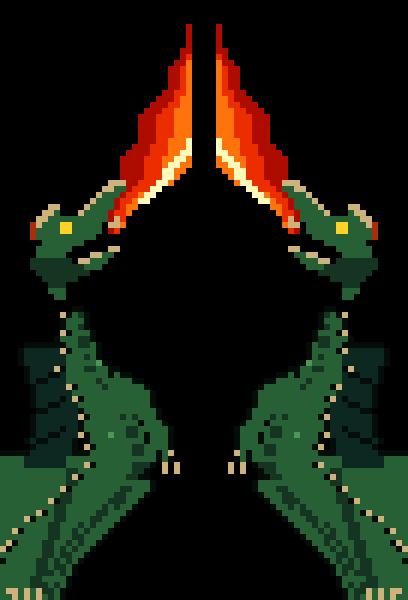

# Heraldic Dragons

Two heraldic, fire-breathing serpentine dragons flank the Claude Code terminal —
high-def half-block pixel art with an 8-phase baked flame animation, breathed from
each dragon's open maw toward the center of the screen.



## What it does

- Renders a **left and right dragon** in 30-column visible gutters clipped from 32-column source art around the main window.
  Each dragon has a horned head, open toothy maw, coiling serpentine body, dorsal
  frill, claws, and a tail/castle footer that reaches the bottom chrome.
- A **flame plume** issues from each maw (8-frame animation: climbing white-hot
  licks and drifting embers), crowning near the top of the frame.
- Constrains the transcript, prompt/footer stack, and modal/sub-agent overlay
  surfaces into the center column instead of letting text render underneath the
  dragons.
- Collapses the **right** dragon/tower gutter at terminal widths `<= 140`
  columns; widths `>= 141` keep both gutters.

## How it works (rendering + layout)

The art is drawn through the bundled renderer's **native `ink-raw-ansi` direct-draw
node**, not per-cell React Boxes. At module-eval time the helper assembles the wall
into pre-baked ANSI strings (`▀` half-blocks, `fg`=top subpixel / `bg`=bottom
subpixel → 2× vertical resolution, full truecolor per subpixel). Per 95 ms tick only
the fire strings swap; the renderer's cell differ + synchronized-update mode 2026
handle the rest, flicker-free.

The layout uses the same global frame strategy as the responsive Capybara package:
physical left/right gutters plus a narrowed `fde` terminal-size context for the
center column; `t4` is reserved for real modal/scrollbox overlay paths. That keeps
prompt wrapping and overlays from measuring the full terminal width without making
normal footer/composer content believe it lives in a modal.

- **Mojibake-safe**: payloads contain **no literal `▀` or ESC bytes** — the runtime
  produces both via `String.fromCharCode(9600)` / `String.fromCharCode(27)`. Art data
  is embedded as pure numeric run arrays.
- **Truecolor primary; 256-color fallback** at runtime via a 6×6×6 cube map.
- Only the fire region re-renders each tick; static dragon geometry is assembled once.

## Target

- Claude Code **2.1.201**, `darwin/arm64` (Bun standalone macho64).
- Module: `/$bunfs/root/src/entrypoints/cli.js`.
- Pinned by whole-binary SHA-256, whole-module SHA-256/length, per-operation old-range
  SHA-256/length, and payload SHA-256s.

## Operations (seams)

All eight are `replace_exact` inserts/replacements (non-overlapping):

1. `…-context-frame-helpers-before-vko` — defines dragon art, responsive right-gutter
   collapse, a center-column `fde` provider, and modal-only `t4` provider.
2. `…-center-columns-a` — shrinks the app shell's local column context by the left
   gutter, responsive right gutter, and any sidebar.
3. `…-main-window-me` — physically wraps the fullscreen main window/transcript row.
4. `…-bottom-stack-de` — physically wraps fullscreen prompt/footer/bottom
   chrome.
5. `…-fullscreen-modal-center-fe` — constrains fullscreen modal/sub-agent overlays to
   the center column.
6. `…-qde-bottom-stack-ee` — constrains the terminal-scroll-region prompt/footer path without clipping footer overlays.
7. `…-qde-overlay-center-te` — constrains the terminal-scroll-region overlay path.
8. `…-fallback-window-v` — applies the same main/bottom frame in the non-fullscreen
   fallback path.

## Manual smoke

`manualSmoke.required = true`. Automated gates can prove package validation, rebuild,
signing, and startup, but this is visual TUI layout work. Correct animation, prompt
wrapping, overlay containment, and resize behavior must be confirmed interactively in a
truecolor terminal.

## Compatibility

- Independent of theme tables (uses literal colors), so no palette seam.
- Shares app-shell seams with other full-window visual packages. It will conflict with
  packages that patch the same anchors; the builder's byte-range overlap check catches
  real conflicts at build time.
- This package is meant to be built alone or with non-overlapping patches, not alongside
  another package that owns the same full-frame layout.

## Build pipeline

This package is generated, not hand-edited. Its source pipeline lives in
`examples/heraldic-dragons-generator/`: `dragon_v13.py` (hand-authored serpentine
dragon body), `paint_scene_v13.py` (adds the flame plume animation),
`compile_v13.py` (RLE-encodes into the data file), `generate_package.py`
(emits this package from whichever target binary you point it at). See that
directory's README for the full regeneration walkthrough.

```bash
cd examples/heraldic-dragons-generator
python3 compile_v13.py
python3 generate_package.py \
  --source ~/.local/share/claude/versions/2.1.201 \
  --source-version 2.1.201 \
  --source-version-output "2.1.201 (Claude Code)"
```

Then build the patched binary from the repo root:

```bash
uv run harnessmonkey enable-patch heraldic-dragons
uv run harnessmonkey build --activate
```

Report `status` should be `manual_smoke_pending` with automated checks passed. Run the
produced binary in a truecolor terminal to confirm before activation.
